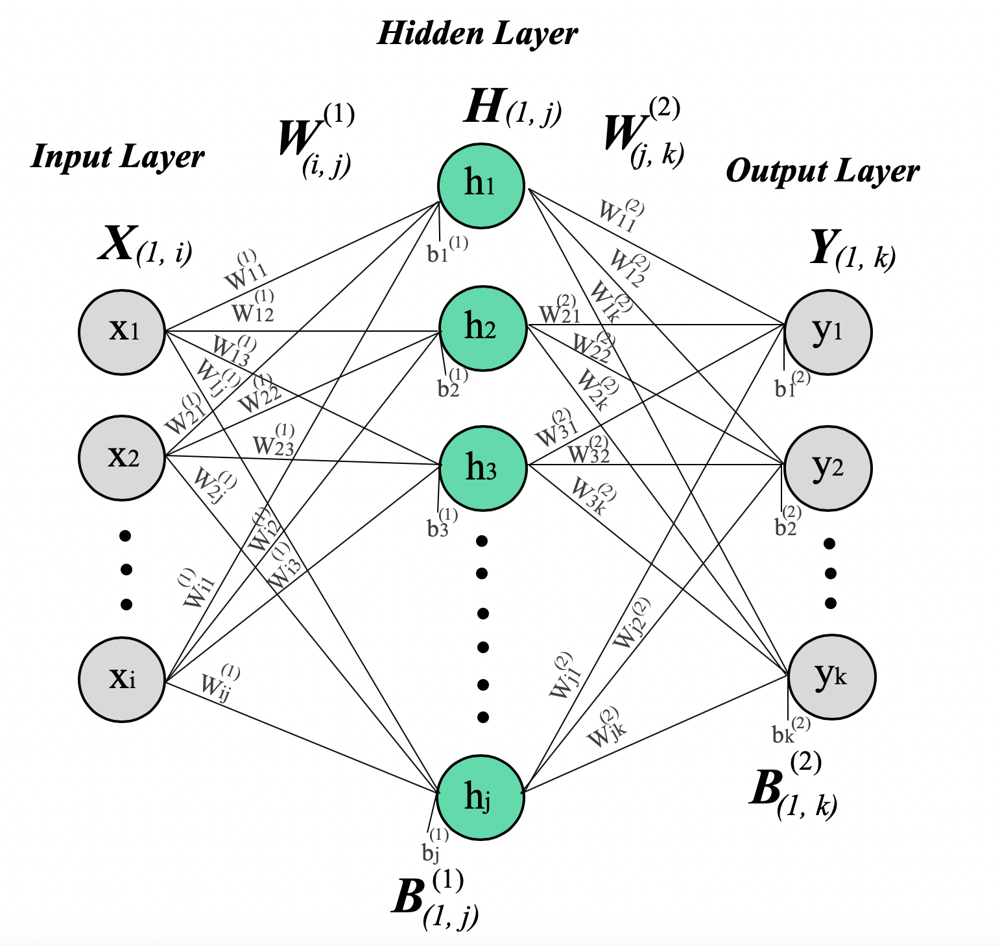
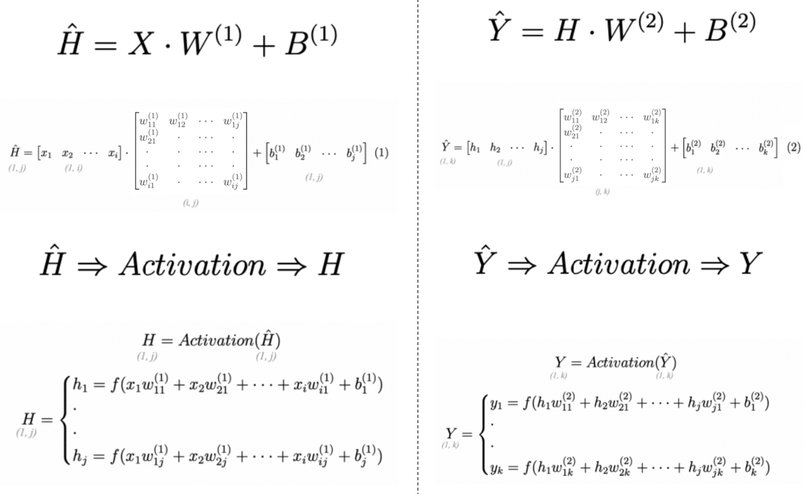
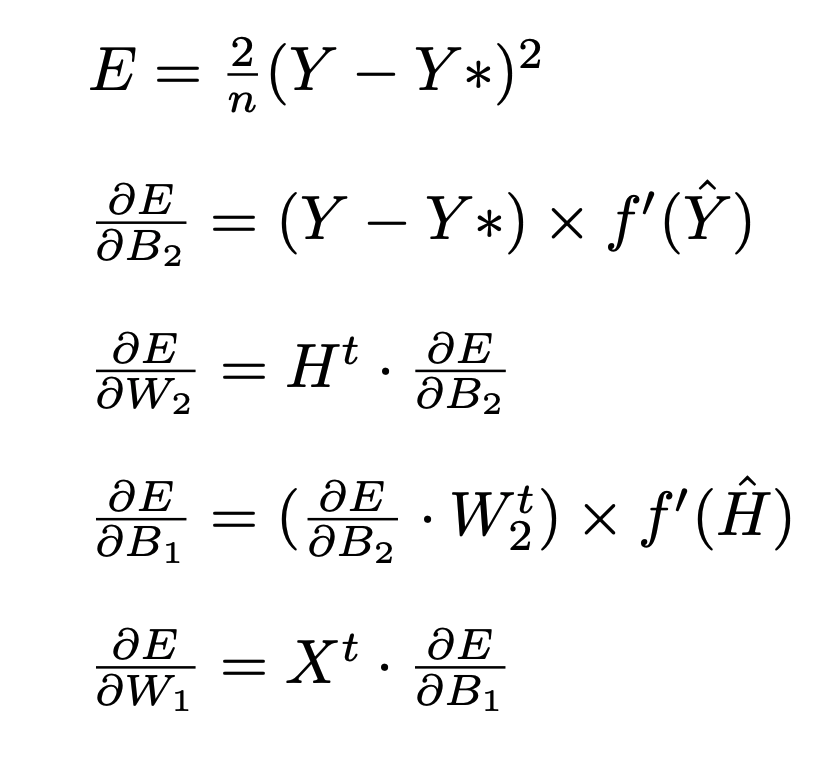
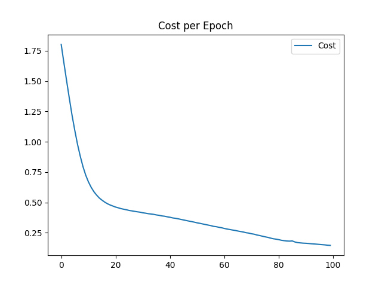
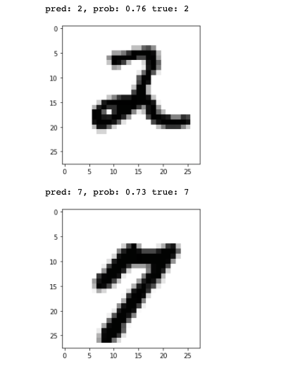

# PySpark-Neural-Network
Pyspark implementation of Shallow Neural Network from scratch using MNIST

## Summary
The goal of this project is to use Spark to build a 3 layer Neural Network from Scratch, using my own mathematical formulas to solve an Image classification Task. I will use the very famous MNIST dataset http://yann.lecun.com/exdb/mnist/.

## Usage

### Jupyter-notebook

To run the code using a local machine, you can use pypark on jupyter-notebook.
Please install `pyspark` before trying to run this code.

To open and modify the jupyter-notebook, use:
```bash
pyspark (should open jupyter-notebook)
```

Then, open the notebook `NeuralNetwork.ipynb`.
This notebook allows to download the MNIST, run a training, and evalute the performance of the model.

### Spark Submit (Local or Cloud)

#### Downloaded the datasets

Use `generate_data.py` to generates the desired dataset and add it to `/data`.
Notes this script use keras framework to the load data (so make sure you have it or use `pip3 install keras`)

Please use:
```bash
python3 generate_data.py
```

For cloud computation, I created a bucket on Google Cloud where you can directly use it:
```bash
gs://marvinmartin27/Project/mnist_images_train.csv
gs://marvinmartin27/Project/mnist_labels_train.csv
gs://marvinmartin27/Project/mnist_images_test.csv
gs://marvinmartin27/Project/mnist_labels_test.csv
```

#### RUN Local Test

```bash
spark-submit main_task.py TRAIN_IMAGE_FILE TRAIN_LABEL_FILE TEST_IMAGE_FILE TEST_LABEL_FILE OUTPUT_FILE

# So locally, you can use
spark-submit main_task.py data/mnist_images_train.csv data/mnist_labels_train.csv data/mnist_images_test.csv data/mnist_labels_test.csv docs/local_test/OUTPUT/

# Generate Plots after training
python3 generate_plots.py docs/local_test/OUTPUT/cost_history/part-00000 docs/local_test/OUTPUT/accuracy_history/part-00000 docs/local_test/OUTPUT/
```
***

## Technical Details

### Dataset

The MNIST dataset has a training set of 60,000 examples, and a test set of 10,000 examples.
Each image is a handwritten digits (from 0 to 9) in gray scale of size 28x28.


### Neural Network architecture

Here is the architecture I decided to implement:


There is 3 layers:
- Input layer, with i neurons, which correspond to the data input size. Here images are 28x28 pixel so, i = 784 neurons
- Hidden layer, with j neurons, where j can be any number, the higher is j, the more complex is the layer (so more computation). I decided to use j = 64 neurons for my classification task.
- Output layer, with k neurons, which correspond to the number of classes. Here k=10 because we used a one hot encoded vector to predict Digits from 0 to 9.

Layers are connected by parameters called Weights and Bias.
For one neuron, also called a perceptron, we have:


Note that I distinguish two terms, one before activation (with ^ notation), and after activation (without ^). This notation is important for the following explanations.

So if we apply the same idea with the entire Network we have the following formulas:

These formulas are used during the so-called Forward propagation (nothing else but a prediction for a given image based on the parameters).
Therefore, the model parameter are W1, B1 to map the Input Layer to the Hidden Layer and W2, B2 to map the Hidden layer to the Output Layer.


Then we compare the predicted one hot vector (from the output layer) to the actual one hot vector label using the Sum of Square formula. Once the error is computed, we want to updates the models parameters based on the minimization of the Error.

To do this optimisation task, I decided to use the mini-batch Gradient Descent implementation.
So, needed the derivative of each model parameters regarding the Error E (with n the number of datapoint in a given mini-batch).

Here is the (vectorized) formulas I obtained:


For more details about the formulas, I wrote a Medium article last year to dive into the mathematics:
https://medium.com/swlh/mathematics-behind-basic-feed-forward-neural-network-3-layers-python-from-scratch-df88085c8049

Then, using these gradients I could update my model parameters using a starting learning rate of 0.1.

For the Batch size, I used the sample method form Spark with a ratio of 0.7 (so 70% of 60,000 is around 42000 images per miniBatch).

Additionally, if you carefully look at my implementation, I used the Bold Driver to improve my Learning rate over the epochs and I also normalized my gradients over the Batch size.

In spark, the forward and backward propagation are equivalent to map and reduce operations over miniBatch (and repeated over Epochs in a for loop).

## Training Results


```bash
# Cost is Decreasing
1.8010366573726742
1.6482835168837298
1.500037649096698
1.3555057252074243
...
0.15244483867717976
0.1505243567941282
0.14784614337715876
0.14643842482111413
```

```bash
# Accuarcy is increasing up to 83%
0.1888286488800114
0.19213432230675667
0.19300169237003315
0.19436840977792588
...
0.826415273556231
0.8323469046823541
0.8318167779335249
```

Here is the plots (in the cloud):



Here is the cloud spark history:


## Testing Results

```bash
# Digit 0 (precision, recall, F1) --> GOOD
(0.9675550394350463, 0.8520408154571012, 0.9061308086825957)

# Digit 1 (precision, recall, F1) --> GOOD
(0.6700477322971076, 0.9894273119035881, 0.7990034311500359)

# Digit 2 (precision, recall, F1) --> GOOD
(0.6276816604652722, 0.878875968140624, 0.7323370183555452)

# Digit 3 (precision, recall, F1) --> VERY BAD
(0.0, 0.0, 0.0)

# Digit 4 (precision, recall, F1) --> BAD
(0.21938661289022013, 0.9979633391059437, 0.35969873173559086)

# Digit 5 (precision, recall, F1) --> BAD
(0.1863100634210539, 0.9215246626440307, 0.30995447123030956)

# Digit 6 (precision, recall, F1) --> BAD
(0.10699128879752164, 0.9999999989561587, 0.1933008745760054)

# Digit 7 (precision, recall, F1) --> GOOD
(0.9911816561002087, 0.5466926064720888, 0.7047017352426795)

# Digit 8 (precision, recall, F1) --> BAD
(0.21745316570608175, 0.941478438458441, 0.3533034900409847)

# Digit 9 (precision, recall, F1) --> BAD
(0.99999950000025, 0.001982160553040475, 0.003956474777450049)
```




**Observation:**

Even if the model has reach 83% of accuracy during the training, it seems that with test data metrics are not as good as expected
Indeed only 4 digits out of 10 (0, 1, 2, 7) have good metrics.

This is a typical example of overfitting.

In deep learning, we usually use more then 1 hidden layer, and use a larger number of neurons in those hidden layer to generate bigger network and Therefore obtain better results.
Also, in deep learning, image classification are usually solved using Convolutional Neural Network, which are more advance type of layers (that learn filters instead of simple weights).

***Improvements:***

To fix this issue, if I could work an additional month on the project, I would have try to use:
- Regularisation L1 or/and L2
- Learning rate Decay
- Add another hidden Layer (mathematics are getting really complex)
- Dropout

Also to improve/optimize the spark implementation I would have try to:
- Use tree aggregate instead of Reduce
- Use mapPartitionWithIndex followed by a filter instead of sample
- Try to reduce the number of map


***
## Local Test Results - OUTPUT FILES
You can see the results of the local machine for each of the tasks in `docs/local_test/*`.

## Google Cloud Submissions - OUTPUT FILES
See the screenshots in the `/docs/screenshots/*` folders.
You can see the results of google cloud computing for each of the tasks in `docs/google_cloud/*`.

## Saved results
In `docs/*/OUTPUT/accuracy_history/` you can find the accuracy for each epoch (line by line).
In `docs/*/OUTPUT/cost_history/` you can find the cost for each epoch (line by line).
In `docs/*/OUTPUT/metrics/` you can find the precision, recall and F1 score for each class.
In `docs/*/OUTPUT/tests/` you can find a sample of test predictions in form of tuples (prediction, label).
